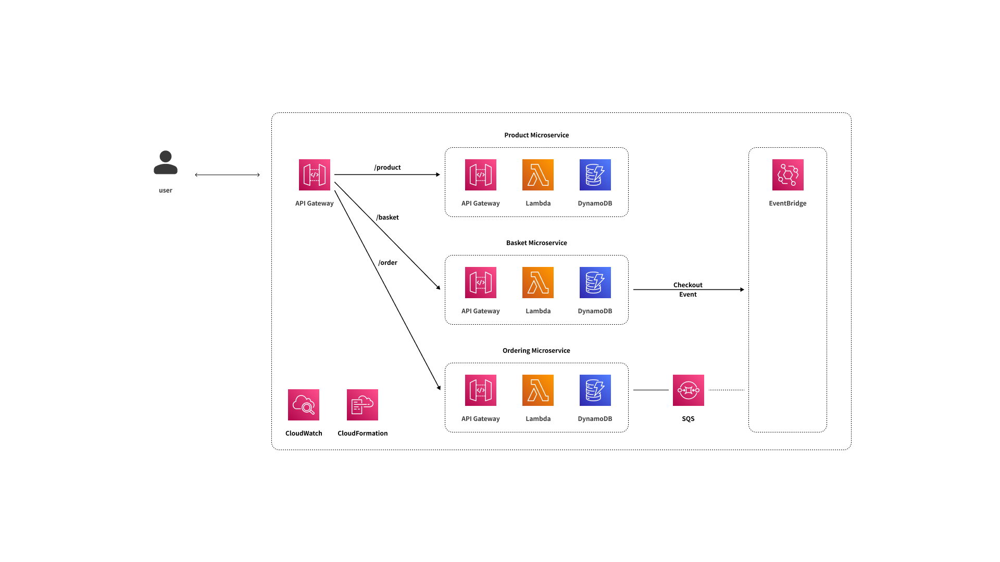

# e-commerce-be

낯선 개발자님, 환영합니다! 😊 <br>
이 저장소는 서버리스 환경에서 시간을 아낄 수 있는 **새 작업 프로세스**를 위해서 만들었습니다.

만약, 당신이 이 저장소에 도움을 받으셨다면, 부디 제 삶의 작은 기쁨을 위해서 좋아요를 눌러주세요.

좋은 하루 되세요!

> 기간 : 11-14, 2022 ~ ing<br>
> 기여자 : [@unchaptered](https://github.com/unchaptered)
> Versions <br>
> - 영어 [열기](./README.md)
> - 한글 [열기 (현재)](./README(KR).md)

```
1. 소개
    1.1. 시작하기
    1.2. 프로젝트 목표
    1.3. 릴리즈 히스토리
2. Stacks (+ reason)
    2.1. AWS Dependencies
    2.2. Other Dependencies
3. 아키텍처
    3.1. 아키텍처 다이어그램
    3.2. 왜 서버리스 아키텍처일까?
    3.3. 왜 마이크로서비스 아키텍처일까?
    3.4. 왜 발행-구독 아키텍처일까?
4. APIs
    4.1. Collection
    4.2. Product 마이크로서비스
    4.3. Basket 마이크로서비스
    4.4. Ordering 마이크로서비스
5. 참고 문서
```

## 1. 소개


### 1.1. 시작하기

준비 중입니다.

### 1.2. 프로젝트 목표

**e-commerce-be** 프로젝트는 다음의 목표를 달성하기 위해 만들어졌습니다. <br>

- [ ] 서버리스 마이크로서비스 아키텍처 구축
    - [x] API Gateway 사용
    - [x] Lambda 사용
    - [x] DynamoDB 사용
    - [ ] EventBus 사용
    - [ ] SQS 사용
- [ ] Serverless 개발, 테스트, 배포 환경 셋업
    - [x] AWS CDK를 사용한 배포 시스템
    - [ ] AWS SAM을 사용한 개발 시스템
    - [ ] Jest, MockEvent를 사용한 테스트 시스템
- [ ] 문서 목차

### 1.3. 릴리즈 히스토리

| 릴리즈          | 설명                             |
| --------------- | ---------------------------------------- |
| v1.0.0          | Product 마이크로서비스 배포하기 (CDK 사용) |

---

## 2. Stacks (+ reason)

***이 섹션은 기술적 결정과 그 이유에 대해서 다루고 있습니다.***

서버 개발자로서, 기술적 결정과 그 이유는 매우 중요합니다.<br>
많은 개발자들은 **좋은 서버를 위해 중요한 것들**에 대해서 말합니다.<br>

대표적으로, `확장성`, `안정성`, `유지 보수성` 그리고 기타 등이 포함됩니다.<br>
그리고 저는 `효율성`과 `시기적절함`도 중요한 사항에 포함해야 한다고 생각합니다.<br>

비즈니스에서, 모든 개발 활동은 시간과 돈을 소모합니다.<br>
극단적 관점에서, 시간과 동은 동일하므로 모든 활동은 돈을 소모합니다.<br>
그것이 **왜 개발자들이 가능한 효율적인 투입 대비 산출물을 비즈니스에 고려**해야 하는 지를 의미합니다.

> 이것은 지극히 개인적인 의견입니다. <br>
> 그러나, 가능한 많은 참고문서와 공식문서를 참고하였습니다.

```
1. AWS Dependenceis
2. Other Dependencies
```

### 2.1. AWS Dependencies

- [x] API Gateway
- [x] Lambda
- [x] DynamoDB
- [ ] EventBridge
- [ ] SQS
- [x] CloudFormation
- [x] CDK(cloud development kit)

<details>
    <summary>✍️기술 선택 이유</summary>

현재, 준비중...

</details>

### 2.2. Other Dependencies

- [x] uuid

<details>
    <summary>✍️기술 선택 이유</summary>

현재, 준비중...

</details>

---

## 3. 아키텍처

### 3.1. 아키텍처 다이어그램

> E-Commerce-Be is clone project.<br>
> It's built as Serverless Microsevices Architecture.<br>



### 3.2. 왜 서버리스 아키텍처일까?

현재, 준비중...

### 3.3. 왜 마이크로서비스 아키텍처일까?

현재, 준비중...

### 3.4. 왜 발행-구독 아키텍처일까?

현재, 준비중...

---

## 4. APIs

**API of E-Commerce-Be** is create

1. Collection
2. Product Microservices
3. Basket Microservices
4. Ordering Microservices

### 4.1. Collection

[API Collection](./docs/collection/e-commerce-be.yaml)

### 4.2. Product 마이크로서비스

| APIs | Description |
| ----- | ---------- |
| GET /product | Get all product |
| POST /product | Post one product |
| GET /product/{id} | Get single product |
| GET /product/{id}?category= | Get single product, filtering with category |
| PUT /product/{id} | Update single product |
| DELETE /product/{id} | Delete single product |


### 4.3. Basket 마이크로서비스

### 4.4. Ordering 마이크로서비스

---

## 5. 참고 문서

- [AWS SDK for JavaScript --v3](https://docs.aws.amazon.com/AWSJavaScriptSDK/v3/latest/index.html)
- [AWS CDK API Reference](https://docs.aws.amazon.com/cdk/api/v2/docs/aws-construct-library.html)
- [Lambda **event and response** with API Gateway as proxy integration](https://docs.aws.amazon.com/ko_kr/lambda/latest/dg/services-apigateway.html)