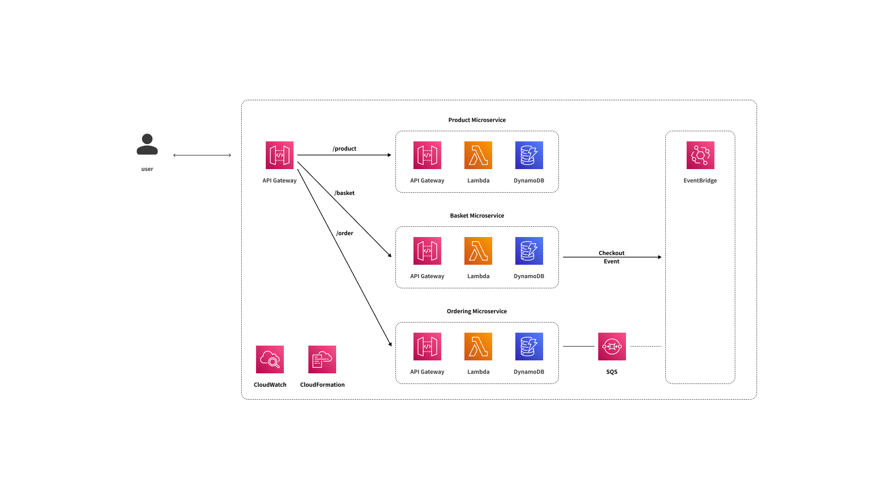
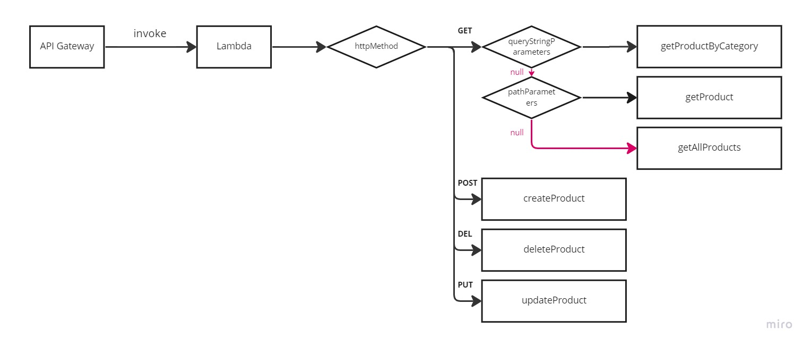

# e-commerce-be

Welcome, strange developer! 😊 <br>
This repository is created for **New Working Process** to save time with Serverless.

If you've been helped by this repository, please star for my small pleasure of life.<br>

Have a good day!

> Period : 11-14, 2022 ~ ing<br>
> Contributers : [@unchaptered](https://github.com/unchaptered)
> Versions <br>
> - English [Open (now)](./README.md)
> - Korean [Open](./README(KR).md)

```
1. Introduce
    1.1. Get Started
    1.2. Goals of proejct
    1.3. Release History
2. Stacks (+ reason)
    2.1. AWS Dependenceis
    2.2. Other Dependencies
3. Architecture
    3.1. Architecture Diagram
    3.2. Why serverless architecture?
    3.3. Why microservices architecture?
    3.4. Why publish-subscribe architecture?
4. APIs
    4.1. Colleciton
    4.2. Product Microservices 
    4.3. Basket Microservices
    4.4. Ordering Microservices
5. References
```

---

## 1. Introduce


### 1.1. Get Started

Now, preparing...
### 1.2. Goals of proejct

This project, **e-commerce-be**, is created to archive these goals.<br>

- [ ] Build Serverless Microservices Architecture 
    - [x] Use API Gateway
    - [x] Use Lambda
    - [x] Use DynamoDB
    - [ ] Use EventBus
    - [ ] Use SQS
- [ ] Set-up Serverless deploy, developement, testing system.
    - [x] Deploy system with AWS CDK
    - [ ] Development system with AWS SAM
    - [ ] Testing system with Jest, MockEvent.

### 1.3. Release History

| Release         | Descdription                             |
| --------------- | ---------------------------------------- |
| [v1.0.0](https://github.com/unchaptered/e-commerce-be/releases/tag/v1.0.0)          | Deploy Product Microsevices with AWS CDK |

---

## 2. Stacks (+ reason)

***This Section deal with technical decision and its reason.***

As a server developer, reasons for technical decision is very important.<br>
Many develoepr say about **important things for good server**.<br>

Representatively, it's `Scalability`, `Reliability`, `Maintencance` and so on.<br>
And I think `efficiency` and `timeliness` should be included in it.<br>

In business, all developement activiteis consume time and money.<br>
In extreme perspective, time is equaled to money, so every activity consume money.<br>
That is **why developer consider input and output as possible as efficiency** for business. <br>

> This is a very personal opinion. <br>
> However, many of them cited references including official documents.

```
2. AWS Dependenceis
2. Other Dependencies
```

### 2.1. AWS Dependencies

- [x] API Gateway
- [x] Lambda
- [x] DynamoDB
- [ ] EventBridge
- [ ] SQS
- [x] CloudFormation
- [x] CDK(cloud development kit)

<details>
    <summary>✍️Reasons for choosing technology</summary>

now, preparing...

</details>

### 2.2. Other Dependencies

- [x] uuid

<details>
    <summary>✍️Reasons for choosing technology</summary>

now, preparing...

</details>

---

## 3. Architecture

### 3.1. Architecture Diagram

> E-Commerce-Be is clone project.<br>
> It's built as Serverless Microsevices Architecture.<br>



### 3.2. Why serverless architecture?

It's preparing, now...

### 3.3. Why microservices architecture?

It's preparing, now...

### 3.4. Why publish-subscribe architecture?

It's preparing, now...

---

## 4. APIs

**API of E-Commerce-Be** is create

1. Collection
2. Product Microservices
3. Basket Microservices
4. Ordering Microservices

### 4.1. Collection

[API Collection](./docs/collection/e-commerce-be.yaml)

### 4.2. Product Microservices

| APIs | Description |
| ----- | ---------- |
| GET /product | Get all product |
| POST /product | Post one product |
| GET /product/{id} | Get single product |
| GET /product/{id}?category= | Get single product, filtering with category |
| PUT /product/{id} | Update single product |
| DELETE /product/{id} | Delete single product |



### 4.3. Basket Microservices

### 4.4. Ordering Microservices

---

## 5. References

- [AWS SDK for JavaScript --v3](https://docs.aws.amazon.com/AWSJavaScriptSDK/v3/latest/index.html)
- [AWS CDK API Reference](https://docs.aws.amazon.com/cdk/api/v2/docs/aws-construct-library.html)
- [Lambda **event and response** with API Gateway as proxy integration](https://docs.aws.amazon.com/ko_kr/lambda/latest/dg/services-apigateway.html)