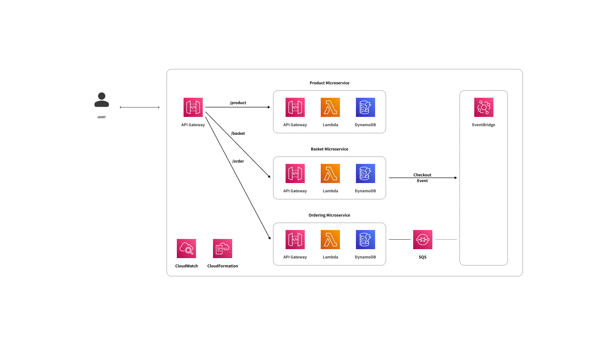
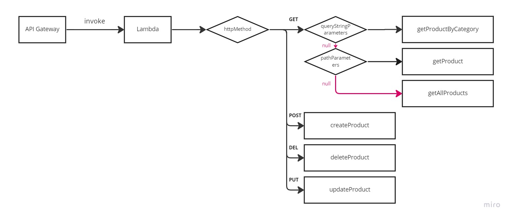

# e-commerce-be

E-Commerce-Be is clone project.<br>
It's built as Serverless Microsevices Architecture.<br>

```
1. Stacks
2. Architecture
    2.1. Infrastructure Acrhitecture
3. Logic of Microservices
    3.1. Product Microservices
4. Core Documents
5. Functional APIs
```

## 1. Stacks

### 1.1. AWS Dependencies

- [x] API Gateway
- [x] Lambda
- [x] DynamoDB
- [ ] EventBridge
- [ ] SQS
- [x] CloudFormation
- [x] CDK(cloud development kit)

<details>
    <summary>✍️Reasons for choosing technology</summary>

now, preparing...

</details>

### 1.2. Other Dependencies

- [x] uuid

<details>
    <summary>✍️Reasons for choosing technology</summary>

now, preparing...

</details>

---

## 2. Architecture

### 2.1. Infrastructure Acrhitecture

>
E-Commerce-Be is clone project.<br>
It's built as Serverless Microsevices Architecture.<br>



## 3. Logic of Microservices

1. Product Microservices

### 3.1. Product Microservices



## 4. Core Documents

- [AWS SDK for JavaScript --v3](https://docs.aws.amazon.com/AWSJavaScriptSDK/v3/latest/index.html)
- [AWS CDK API Reference](https://docs.aws.amazon.com/cdk/api/v2/docs/aws-construct-library.html)
- [Lambda **event and response** with API Gateway as proxy integration](https://docs.aws.amazon.com/ko_kr/lambda/latest/dg/services-apigateway.html)

## 5. Functional APIs
    
| APIs | Description |
| ----- | ---------- |
| GET /product | Get all product |
| POST /product | Post one product |
| GET /product/{id} | Get single product |
| PUT /product/{id} | Update single product |
| DELETE /product/{id} | Delete single product |
